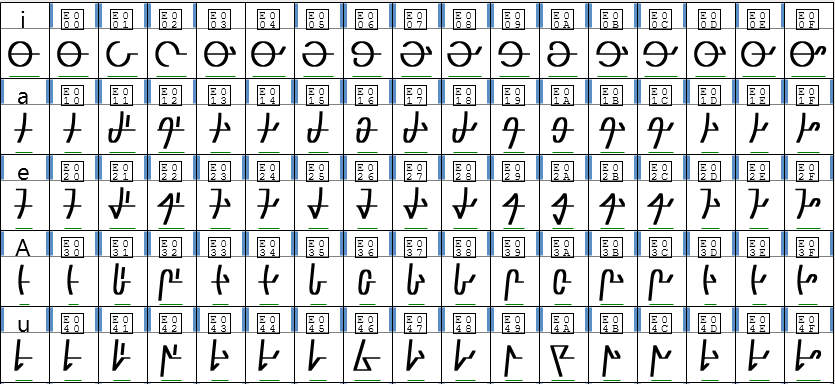
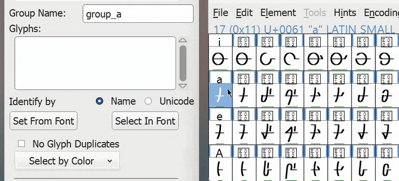

# Journal I: FontForge & Error Recovery

> *Braden Currah - 11/10/2025*

[FontForge](https://fontforge.org/) is an open-source application with a comprehensive set of tools for creating and editing fonts. It is a complex piece of software with many legacy features, and as is common with complex software there are many opportunities to make mistakes. FontForge has a special peculiarity that adds to this, but in order to arrive there we first need to open it up.

This is a daunting first impression for a piece of software- the design of which warrants a journal of its own- but fortunately for this journal we are only concerned with the panel on the right. That panel is the Font view, which displays all of the *glyphs* (the letters and symbols) contained in our font. These glyphs are sorted by their *Unicode value*- that is, the order (or *encoding*) that is standard for the digital Latin alphabet.

We are ready for the thing that makes FontForge so peculiar: undo and redo operations are stored *per-glyph*, rather than a global operation that affects the entire application. This subverts a usual **convention** typically found in software, but proves to be incredibly convenient. This is because working on a font typically involves a lot of back-and-forth between glyphs, and so correcting a mistake made in one glyph does not necessitate reversing progress made on another. There is one downside to this structure, which we will see in a moment.

In this particular instance I had been using FontForge to create a font for a fictional language, a portion of which is pictured above. This is notable because, unlike a regular Latin font, it does not follow a standard encoding. Instead, this font is organized into rows of 16 related glyphs, which I relied on heavily while editing and configuring the text.

There are about 150 symbols in this language, including a host of numbers, [ligatures](https://en.wikipedia.org/wiki/Ligature_(writing)), and [diacritics](https://en.wikipedia.org/wiki/Diacritic). This is why when I noticed the menu option *Display by Groups*, which allows glyphs to be selectively hidden, I was eager to take advantage.

The first step in using this feature was to sort the glyphs into groups, which can be done interactively by selecting the symbols from the Font view. This **efficiently** used existing interactions in the interface, and prevented me from having to type every glyph name by hand.

Once the groups are defined, using the tool is simply a matter of choosing one or more and pressing *OK*.

This is great! I can focus on a single set of glyphs at a time. But later, how do I unhide them? Here is our first struggle. I can select other groups to show them, but I only made two. What about the rest? Scouring the menus did not reveal any **affordances** that would indicate a way to reverse this. The [documentation](https://fontforge.org/docs/ui/dialogs/groups.html#display-by-groups), which describes the feature in detail, omits this information as well.

After some experimentation, I eventually found a solution. It involves the following steps:

1. Create a new group, not of glyphs, but of a *color*. In this case I guessed- because all glyphs are black and white- the default color.
2. In *Display by Groups*, select the new 'color' group, and press *OK*.

Clearly, this is not an ideal interaction. I only found a solution by chance, and it is one that is far too roundabout to be the intended use case. At least we managed to avoid disaster and reveal all of the glyphs once again.

Hold on, something is not correct here. It was subtle, but the glyphs are definitely not in the same order they were in previously. In fact, the entire font- all 150 glyphs- had been rearranged into the Latin encoding. Which, as we saw, is not an ideal order for this entirely non-Latin language.

This was strange, but I was not too concerned. After all, I could simply undo the changes I had made to the font up until this point, right? Here is the second and critical problem. FontForge uses a *per-glyph* undo operation, but the order of the glyphs- and for that matter any font-wide configuration- does not belong to any particular glyph. In other words, any global change is *entirely destructive*. There is no **error recovery** in place for these operations.

The effort required to move every glyph back into place, and to fix some features of the font that were broken by this rearrangement, seemed greater than the effort required to restart from scratch. So, the file was effectively destroyed by this seemingly innocent sequence of events.

Later work on this language would find the FontForge project growing increasingly unstable and, on occasion, crashing in such a way that the project file was deleted outright. Creating backups became a routine. This experience highlighted the *necessity* for proper **error prevention** and **recovery** features, especially when the error can be catastrophic and cost the user many hours of work.
